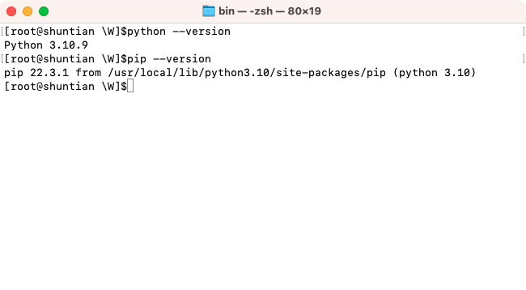
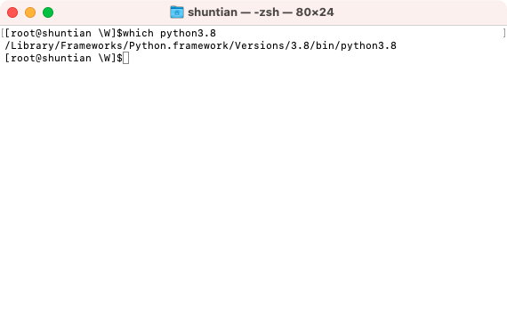
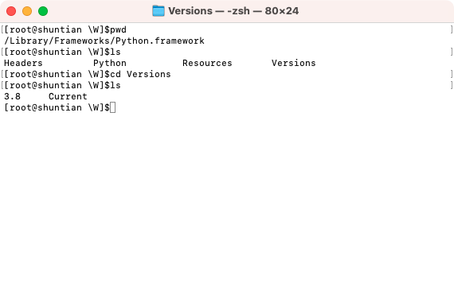
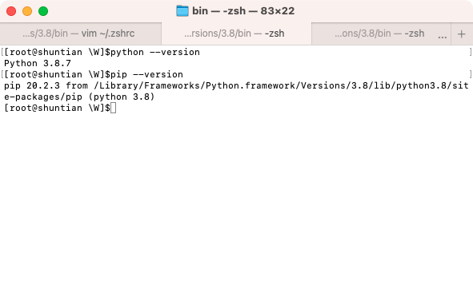
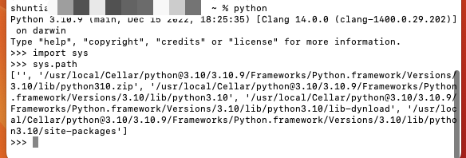

# python 安装与卸载

## 检查是否安装了python 

查看电脑自带版本:

```bash
# python2
python --version

# python3
python3 --version
```

python 都安装在哪里

```bash
# 如果是python2
where python

# 如果是 python3
where python3
```

当前使用 python 版本

```bash
which python
```

## 安装 python

### python 安装路径

| 安装方式             | 安装位置                                            |
| -------------------- | --------------------------------------------------- |
| HomeBrew 安装        | /usr/local/Cellar/python                            |
| 官网下载安装         | /Library/Frameworks/Python.framework                |
| mac 自带 python 路径 | /System/Library/Frameworks/Python.framework/Version |

### 方案一:

#### 安装

```bash
brew install python3
```

#### 配置

方案一:

1. 如果没有 python 命令 和 pip 命令, 可以直接生成新的软链接

```bash
cp /usr/local/bin/python3 /usr/local/bin/python
cp /usr/local/bin/pip3 /usr/local/bin/pip
```

3. 查看 Python 版本:  python --version
4. pip 查看版本: pip --version

方案二:

1. 终端输入：vi ~/.zshrc
2. 直接 vi 打开进行编辑，编辑完保存

```bash
##python
export PATH="/usr/local/Cellar/python@3.10/3.10.9/bin:${PATH}"
alias python="/usr/local/Cellar/python@3.10/3.10.9/bin/python3"
alias pip="/usr/local/Cellar/python@3.10/3.10.9/bin/pip3"
```

3. 中断输入：source ~/.zshrc
4. 查看 Python 版本:  python --version
5. pip 查看版本: pip --version



#### 卸载

```
brew uninstall python3

# 修改 .zshrc
删除之前添加的软链接
```

### 方案二:

#### 安装

1. 官网下载：[https://www.python.org/downloads/](https://link.zhihu.com/?target=https%3A//www.python.org/downloads/)
2. 下载指定版本如: 3.8.7
3. 一路默认安装

#### **配置**

1. 在终端输入：which python3.8，可查看快捷方式存在的路径，如图



2. 安装路径：/Library/Frameworks/Python.framework



3. 终端输入：vi ~/.zshrc

4. 直接 vi 打开进行编辑，编辑完保存

```
export PATH="/Library/Frameworks/Python.framework/Versions/3.8/bin:${PATH}"
alias python="/Library/Frameworks/Python.framework/Versions/3.8/bin/python3"
alias pip="/Library/Frameworks/Python.framework/Versions/3.8/bin/pip3"
```

3. 中断输入：source ~/.zshrc

4. 查看 Python 版本:  python --version

5. pip 查看版本: pip --version



#### 卸载

1. Python3 安装完后，在系统中不同目录下存在各种依赖关系，若需卸载，需要一步步无残留完全卸载干净。

2. 删除Python 3.8 框架，打开终端，输入

```bash
sudo rm -rf /Library/Frameworks/Python.framework/Versions/3.8
```

3. 删除 Python 3.8 应用目录

```bash
cd /Applications

sudo rm -rf Python 3.8
```

4. 删除/usr/local/bin 目录下指向的Python3.8 的连接

```bash
cd /usr/local/bin/
# 显示软链
ls -l /usr/local/bin

# 删除相关的软链
# Python3.8 相关的文件和链接需要自行确认是否删除
rm python3.8
rm pip3.8
rm pydoc3.8
rm python3.8-config
```

5. 删除 Python 的环境路径

```bash
vi ~/.bash_profile
```

6. 确认python 是否已经删除

```bash
python3.8
-bash: python3.8: command not found
```

## 查看 python 安装路径

```bash
# 输入命令
python

# 输入代码
>>> import sys
>>> sys.path

```



## 命令位置

| 类型         | 位置                                             |
| ------------ | ------------------------------------------------ |
| 系统命令     | /usr/bin                                         |
| 用户默认命令 | /usr/local/bin (brew 安装的命令默认在这个路径下) |

