# js 中文, 英文, 数字混排实现方案

## numer 数组排序

```js
const numbers = [12, 2, 34, 5, 44];
numbers.sort();
```

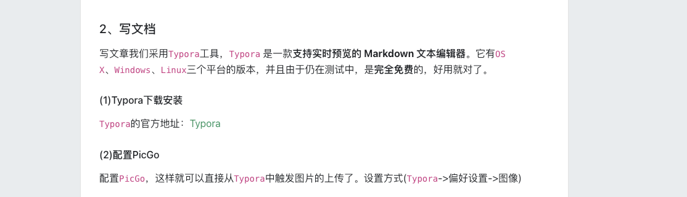

**结果:** 排序后的结果不是按照 number 值大小进行排序的

**原因:** Array.prototype.sort() 方法用原地算法对数组的元素进行排序，并返回数组。默认排序顺序是在将元素转换为字符串，然后比较它们的 UTF-16 代码单元值序列时构建的

**解决方案:**

```js
const numbers = [12, 2, 34, 5, 44];
numbers.sort((a, b) => a - b);
```

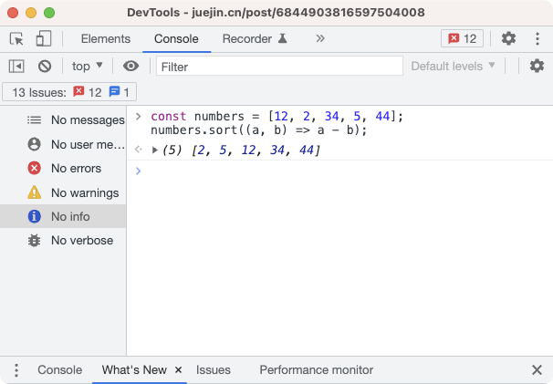

## 英文字符串排序

### 小写排序
```js
const english = ['aa', 'jk', 'da', 'cd', 'fe'];
english.sort();
```


**结果:** 符合预期, 是按照英文字母的顺序进行排序的

**原因:** 英文字符的 acsii[unicode] 码顺序和字母的顺序一致

### 大小写混排
```js
const english = ['aa', 'jk', 'Ad', 'cd', 'Ce'];
english.sort();
```

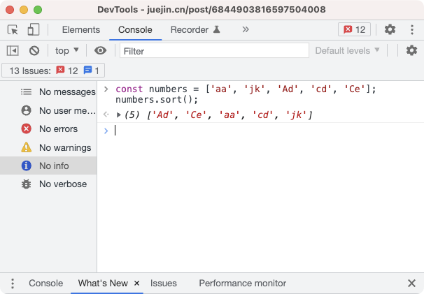

**结果:** 大写在前, 小写在后

**原因:** 大写英文字符的 ascii[unicode] 码值在小写英文字母的前面

**解决方案:** 不区分大小写字母进行排序
```js
方案1: 
const english = ['aa', 'jk', 'Ad', 'cd', 'Ce'];
english.sort((a, b) => {
    const aa = a.toLocaleLowerCase();
    const bb = a.toLocaleLowerCase();
    return aa.localeCompare(bb)
});
方案2: 
const english = ['aa', 'jk', 'Ad', 'cd', 'Ce'];
english.sort((a, b) => {
    return a.localeCompare(b, undefined, {sensitivity: 'base'})
});
```

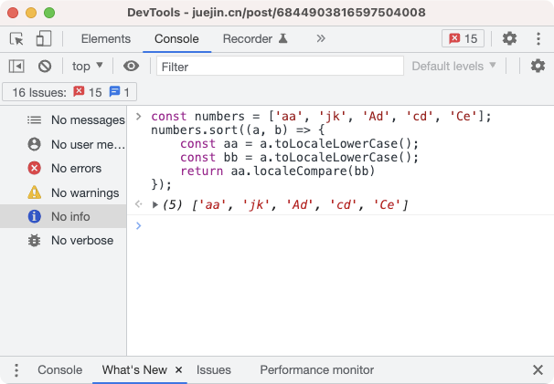

## 中文字符

```js
const chinese = ['中国', '北京', '天津', '上海', '重庆'];
chinese.sort();
```

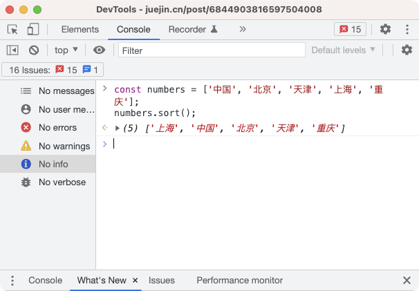

**结果:** 中文的排序不是按照中文首字母进行排序的 

**原因:** 中文的 unicode 码不是按照拼音顺序进行排序的
[中文对应的 unicode 码](https://github.com/shuntian/chinese-chartset/blob/master/docs/02_中文unicode.md)
[中文对应的 拼音](https://github.com/shuntian/chinese-chartset/blob/master/docs/01_中文拼音.md)

**解决方案:**

```js
const chinese = ['中国', '北京', '天津', '上海', '重庆'];
chinese.sort((a, b) => {
    return a.localeCompare(b);
});
```

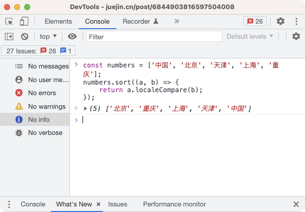

**其他问题:**

**问题1:** 不同的 node 版本执行结果不一致
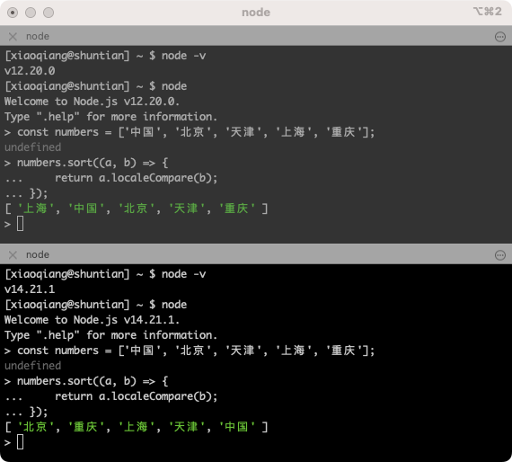

目前测试 12 不一致, 14, 15, 16 都一致, node 版本高的话可以忽略这个问题

**问题2:** linux 下 和 macos 下 node, 输出结果不同

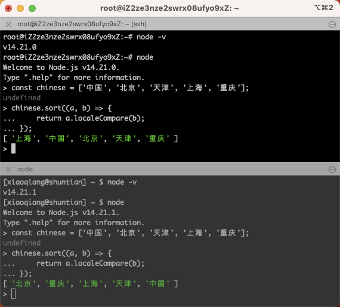

**问题2: 解决方案**
```js
const chinese = ['中国', '北京', '天津', '上海', '重庆'];
chinese.sort((a, b) => {
    return a.localeCompare(b, 'zh-Hans-CN');
});
```

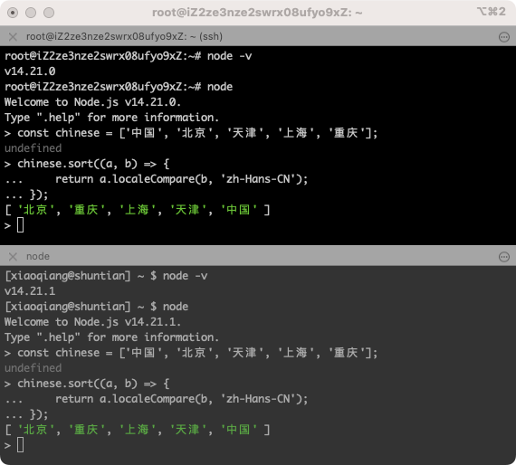


## 中文, 英文, 数字字符串混排

```js
const chinese = ['12', '112', 'dea', 'abs', '中国', '北京', '天津', '上海', '重庆', 'edea', '中a', '中国b', '北京1', '北京2', '北京12'];
chinese.sort((a, b) => {
    return a.localeCompare(b, 'zh-Hans-CN');
});
```

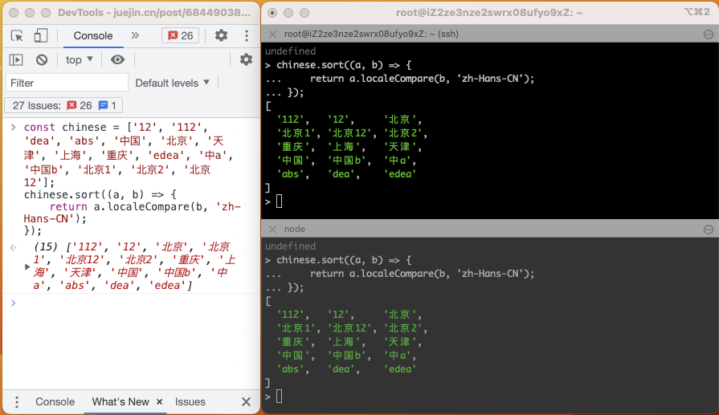


**结果:**

1. 数字在前, 中文其次, 英文最后
2. 数字按照字符串的 unicode 编码进行比较, 而不是数值大小比较
2. 中文是按照拼音顺序进行排序的
3. 英文也是按照 unicode 编码排序的

## 中文, 英文, 数字字符串混排, 按照数值大小对数值字符串排序
```js
const chinese = ['12', '112', 'dea', 'abs', '中国', '北京', '天津', '上海', '重庆', 'edea', '中a', '中国b', '北京1', '北京2', '北京12'];

chinese.sort((a, b) => {
    return a.localeCompare(b, 'zh-Hans-CN', {numeric: true});
});
```


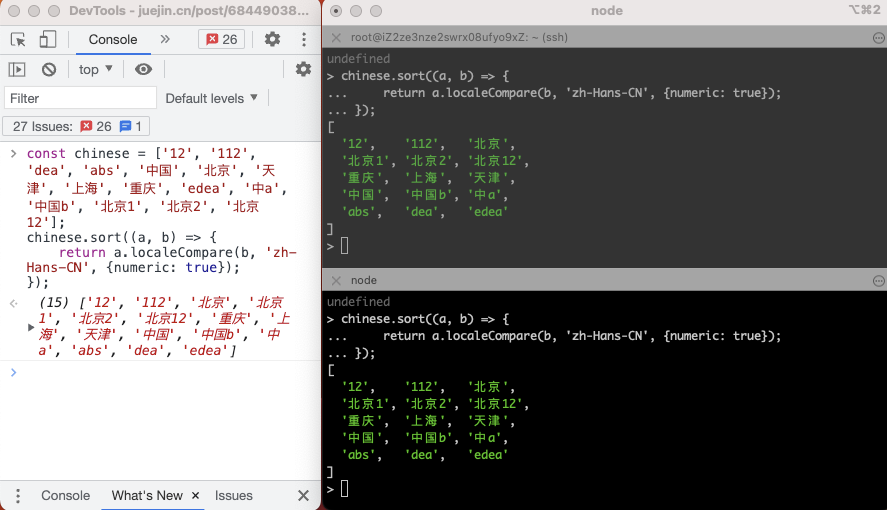

## 中文, 英文, 数字字符串混排, 按照数值大小对数值字符串排序, 且英文排在数字后面
```js
const chinese = ['12', '112', 'dea', 'abs', '中国', '北京', '天津', '上海', '重庆', 'edea', '中a', '中国q', '北京1', '北京2', '北京12'];
const isLetterOrNumberReg = (str) => {
    return /^[0-9a-zA-Z]+$/.test(str);
}
const isAllChineseStr = (str) => {
    return /^[\u4E00-\u9FA5]+$/.test(str);
};
const splitStringByNumber = (str, sortByNumericalSize = false) => {
  let strArr = [];
  const REG_STRING_NUMBER_PARTS = /\d+|\D+/g;
  const arr = str.match(REG_STRING_NUMBER_PARTS);
  for (let i = 0; i < arr.length; i++) {
    const splitStr = arr[i];
    if (isNaN(splitStr)) {
      strArr = strArr.concat(splitStr.split(''));
    } else {
      // Whether to split numbers
      if (!sortByNumericalSize) {
        strArr = strArr.concat(splitStr.split(''));
      } else {
        strArr.push(splitStr);
      }
    }
  }
  return strArr;
};
chinese.sort((a, b) => {
    // 都是数字或字母
    if (isLetterOrNumberReg(a) && isLetterOrNumberReg(b)) {
        return a.localeCompare(b, 'zh-Hans-CN', {numeric: true}); 
    }

    // 中文字符串自己比较
    if (isAllChineseStr(a) && isAllChineseStr(b)) {
        return a.localeCompare(b, 'zh-Hans-CN', {numeric: true});
    }

    const sortByNumericalSize = true;
    const arrA = splitStringByNumber(a, sortByNumericalSize);
    const arrB = splitStringByNumber(b, sortByNumericalSize);

    let result = 0;
    const length = Math.min(arrA.length, arrB.length);
    for (let i = 0; i < length; i++) {
        const charA = arrA[i];
        const charB = arrB[i];
        // 数字, 字符串排在 中文前面
        if (!isAllChineseStr(charA) && isAllChineseStr(charB)) {
            return -1;
        }

        if (isAllChineseStr(charA) && !isAllChineseStr(charB)) {
            return 1;
        }

        // 中文字符直接比较
        if (isAllChineseStr(charA) && isAllChineseStr(charB)) {
            result = charA.localeCompare(charB, 'zh-Hans-CN');
        } else {
            // 都不是中文
            result = charA.localeCompare(charB, 'zh-Hans-CN', {numeric: true});
        }


        if (result !== 0) {
            return result;
        }
    }

    // result === 0;
    if (arrA.length > arrB.length) return 1;
    if (arrA.length < arrB.length) return -1;
    return 0;
});
```

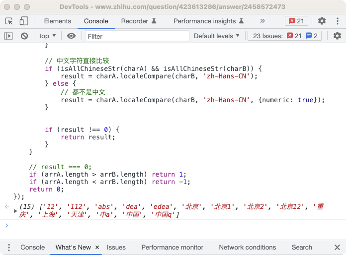


代码优化
```js
const chinese = ['12', '112', 'dea', 'abs', '中国', '北京', '天津', '上海', '重庆', 'edea', '中a', '中国q', '北京1', '北京2', '北京12'];
const isLetterOrNumberReg = (str) => {
    return /^[0-9a-zA-Z]+$/.test(str);
}
const isAllChineseStr = (str) => {
    return /^[\u4E00-\u9FA5]+$/.test(str);
};
const splitStringByNumber = (str, sortByNumericalSize = false) => {
  let strArr = [];
  const REG_STRING_NUMBER_PARTS = /\d+|\D+/g;
  const arr = str.match(REG_STRING_NUMBER_PARTS);
  for (let i = 0; i < arr.length; i++) {
    const splitStr = arr[i];
    if (isNaN(splitStr)) {
      strArr = strArr.concat(splitStr.split(''));
    } else {
      // Whether to split numbers
      if (!sortByNumericalSize) {
        strArr = strArr.concat(splitStr.split(''));
      } else {
        strArr.push(splitStr);
      }
    }
  }
  return strArr;
};
const compare = (a, b, sortByNumericalSize = true) => {
    // 都是数字或字母
    if (isLetterOrNumberReg(a) && isLetterOrNumberReg(b)) {
        return a.localeCompare(b, 'zh-Hans-CN', {numeric: true}); 
    }

    // 中文字符串自己比较
    if (isAllChineseStr(a) && isAllChineseStr(b)) {
        return a.localeCompare(b, 'zh-Hans-CN', {numeric: true});
    }

    const arrA = splitStringByNumber(a, sortByNumericalSize);
    const arrB = splitStringByNumber(b, sortByNumericalSize);

    let result = 0;
    const length = Math.min(arrA.length, arrB.length);
    for (let i = 0; i < length; i++) {
        const charA = arrA[i];
        const charB = arrB[i];
        // 数字, 字符串排在 中文前面
        if (!isAllChineseStr(charA) && isAllChineseStr(charB)) {
            return -1;
        }

        if (isAllChineseStr(charA) && !isAllChineseStr(charB)) {
            return 1;
        }

        // 中文字符直接比较
        if (isAllChineseStr(charA) && isAllChineseStr(charB)) {
            result = charA.localeCompare(charB, 'zh-Hans-CN');
        } else {
            // 都不是中文
            result = charA.localeCompare(charB, 'zh-Hans-CN', {numeric: true});
        }


        if (result !== 0) {
            return result;
        }
    }

    // result === 0;
    if (arrA.length > arrB.length) return 1;
    if (arrA.length < arrB.length) return -1;
    return 0;
}
chinese.sort((a, b) => compare(a, b, true));
```


